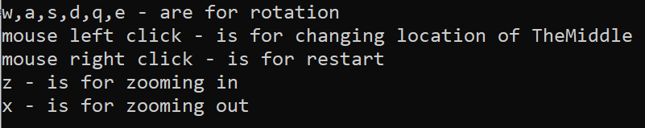

# Technologies
C++, GLFW, OpenGL, math, 2D and 3D Graphics, Physics Simulation, VisualStudio

# Overview
This project simulates the physics of gravitational attraction between supermassive body and other massless bodies.

(for example our Sun is [99.86% of our solar system](https://www.google.com/search?q=how+many+times+sun+is+heavier+than+solar+system&oq=how+many+times+sun+is+heavier+than+solar+system&gs_lcrp=EgZjaHJvbWUyBggAEEUYOTIKCAEQABiABBiiBDIKCAIQABiABBiiBDIKCAMQABiABBiiBDIKCAQQABiABBiiBDIKCAUQABiABBiiBNIBCTIzMDE4ajBqN6gCCLACAQ&sourceid=chrome&ie=UTF-8), so those 0.14% can be ignored). 

It visualizes how bodies in space interact with each other through gravitational forces. 

The simulation includes both 2D and 3D models to show the complex dynamics of such systems.

# About Project
This project was created as a study in physics and computational simulation.

## Math
The simulation is based on [Newton's law of universal gravitation](https://en.wikipedia.org/wiki/Newton%27s_law_of_universal_gravitation), which describes the gravitational attraction between two bodies:

$$
F = G {{m_1 m_2} \over {r^2}}
$$

where:
- $F$ is the gravitational force,
- $G$ is the gravitational constant,
- $m_1$ and $m_2$ are the masses of the two bodies, and
- $r$ is the distance between the centers of the two masses.

In the simulation, each body moves according to the gravitational forces applied by **the center super massive body**. 

The velocity and position of each body are updated using numerical integration techniques, simulating real-time movement under gravitational influence. 

### Example 1: 2d simulation

## Simulation Modes
- **2D Simulation**: Visualizes the gravitational system in a two-dimensional plane.
- **3D Simulation**: Adds depth to the simulation, providing a more accurate representation of how celestial bodies move in space.

### Example 2: 3d simulation

## User Interface

The simulation provides a set of interactive controls:
- **Center of Mass View** (aka TheMiddle): you can change location of the supermassive body
- **Zooming**: You can zoom in and out to explore different regions of the simulated galaxy.

## Unusual Bug
If you zoom in too close to theMiddle you would see something unexpected like this:

P.S. That wasn't supposed to happen in the firstplace

## My explanation of the phenomenon
Some of the bodies appear as "stuck" dots that don't move.

It can be explained like this: when a body is inside of *theMiddle* it is still attracted to it. 

But on the next step of moving that body can't "escape" out of *theMiddle* and appears in *theMiddle* again.

For beauty reasons I've cut every 2nd iteration from visualisation (in other case in *theMiddle* would happen blinking (not cool))

Adding some color voila

These points resemble fractal-like structures or other aesthetic designs. 

This effect does not impact the overall gravitational calculations but is an interesting artifact of the zoom behavior.

## Bonus
Same bug in 3D:

Same bug, other color

## Features
- Real-time 2D and 3D gravitational simulation
- Interactive zooming
- Dynamic gravitational system with multiple bodies
